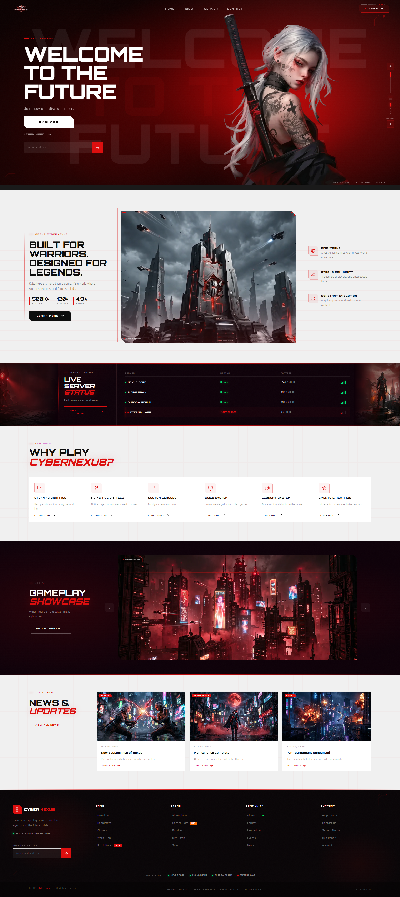
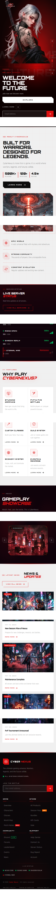

#  CYBER NEXUS

<div align="center">



# ⚡ Cyber Nexus

### Next-Generation Gaming Experience Built With Shopify Liquid

A futuristic cyberpunk-inspired Shopify storefront featuring cinematic visuals, immersive UI animations, responsive layouts, and high-performance theme architecture.

<br>


<br>

### 🚀 Live Demo • 📱 Mobile Optimized • ⚡ Smooth Animations

</div>

---

# 🎮 Overview

Cyber Nexus is a premium futuristic gaming-inspired Shopify storefront designed to deliver a cinematic user experience.

The project combines advanced Shopify Liquid development with immersive cyberpunk visuals, animated interactions, modern UI systems, and responsive performance across all devices.

Built to showcase digital products, gaming brands, communities, memberships, and futuristic eCommerce experiences.

---

# 🖥️ Desktop Experience


---

# 📱 Mobile Experience



---

# ✨ Core Features

<table>
<tr>
<td width="50%">

### ⚡ Futuristic Hero Section

- Massive cinematic hero banner
- Layered visual effects
- Interactive call-to-actions
- Immersive user onboarding

</td>

<td width="50%">

### 🎮 Gaming Inspired UI

- Cyberpunk aesthetics
- Advanced visual hierarchy
- Custom layouts
- Premium interface system

</td>
</tr>

<tr>
<td>

### 🚀 Performance Optimized

- Lightweight architecture
- Fast loading experience
- Shopify best practices
- Optimized assets

</td>

<td>

### 📱 Fully Responsive

- Mobile-first development
- Tablet optimized
- Desktop optimized
- Adaptive layouts

</td>
</tr>
</table>

---

# 🏙️ Sections Included

## Hero Experience
Immersive landing section featuring futuristic visuals, newsletter capture, and primary CTA actions.

## About Cyber Nexus
Storytelling section with world-building content and statistics.

## Live Server Status
Real-time inspired server monitoring dashboard.

## Gameplay Showcase
Large visual presentation area for trailers, gameplay previews, and promotional content.

## Features Grid
Custom-designed cards highlighting gameplay mechanics and platform benefits.

## News & Updates
Dynamic content section displaying latest announcements and events.

## Premium Footer
Multi-column navigation, newsletter integration, and community links.

---

# 🛠 Technology Stack

```yaml
Frontend:
  - Shopify Liquid
  - HTML5
  - CSS3
  - JavaScript

Design:
  - Responsive Layout
  - CSS Animations
  - Advanced UI Components
  - Mobile First Design

Optimization:
  - SEO Friendly
  - Performance Focused
  - Clean Code Architecture
```

---

# 📂 Project Structure

```bash
.
├── assets
│   ├── hero-desktop.png
│   ├── hero-mobile.png
│   ├── theme.css
│   ├── theme.js
│   └── images
│
├── layout
│   └── theme.liquid
│
├── sections
│   ├── hero-banner.liquid
│   ├── about-section.liquid
│   ├── server-status.liquid
│   ├── gameplay-showcase.liquid
│   ├── news-section.liquid
│   └── footer.liquid
│
├── snippets
│
├── templates
│
└── config
```

---

# 🎨 Design Philosophy

Cyber Nexus was designed around three core principles:

### 01 — Immersion
Create an experience that feels like entering a futuristic digital world.

### 02 — Performance
Deliver smooth interactions without sacrificing speed.

### 03 — Scalability
Allow easy customization and expansion through Shopify's architecture.

---

# 📈 Performance Goals

| Metric | Status |
|----------|----------|
| Mobile Responsive | ✅ |
| Desktop Responsive | ✅ |
| Shopify Compatible | ✅ |
| SEO Optimized | ✅ |
| Fast Loading | ✅ |
| Clean Architecture | ✅ |
| Modern UI/UX | ✅ |

---

# 🚀 Getting Started

Clone the repository:

```bash
git clone https://github.com/arnavasif/cyber-nexus.git
```

Install Shopify CLI:

```bash
npm install -g @shopify/cli
```

Start development server:

```bash
shopify theme dev
```

Deploy theme:

```bash
shopify theme push
```

---

# 🎯 Highlights

- AAA Gaming Inspired Interface
- Premium Visual Design
- Shopify Liquid Development
- Responsive Experience
- Smooth Animations
- Modern UI Components
- Cyberpunk Design System
- Advanced Layout Architecture

---

# 🌌 Future Roadmap

- [ ] Dark / Light Theme Switcher
- [ ] Dynamic News CMS
- [ ] Advanced Animation Library
- [ ] Interactive Game Statistics
- [ ] Multi-language Support
- [ ] Enhanced Performance Optimizations

---

# 👨‍💻 Developer

### Arnav Asif

Shopify Developer • Frontend Developer • UI/UX Enthusiast

Specialized in:

- Shopify Theme Development
- Shopify Liquid
- Premium Landing Pages
- Advanced Frontend Interfaces
- Responsive Web Experiences

---

<div align="center">

# ⭐ STAR THIS REPOSITORY

If you appreciate the design and development behind Cyber Nexus, consider giving the project a star.

### Built with Shopify Liquid ⚡

</div>